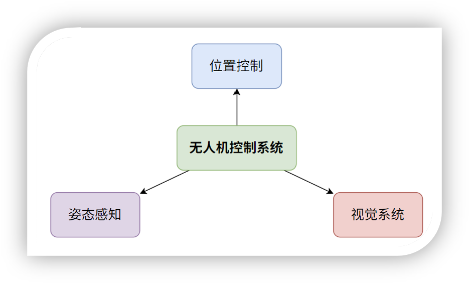
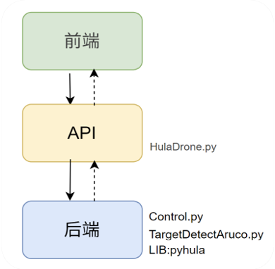
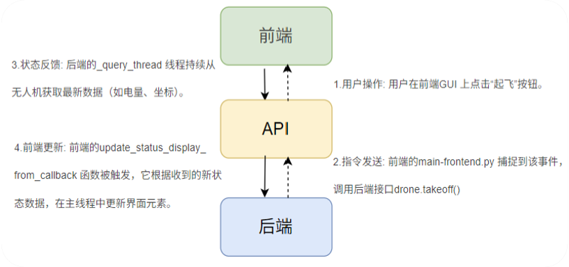
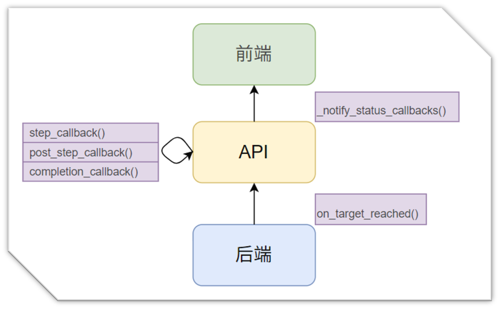
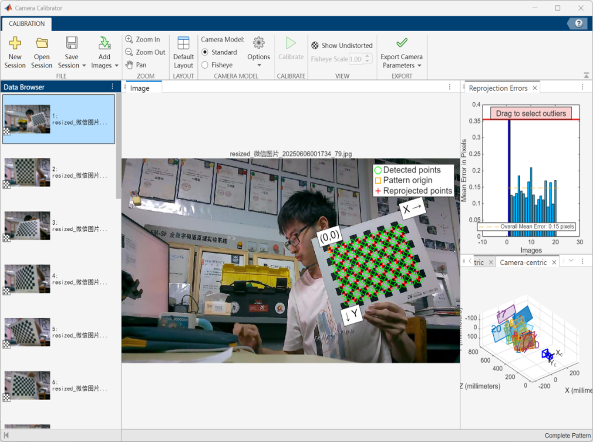
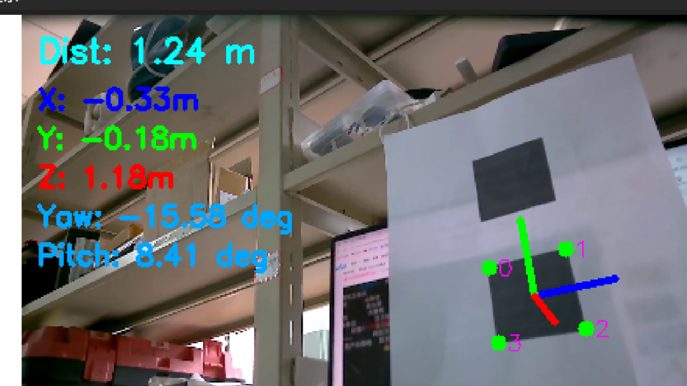
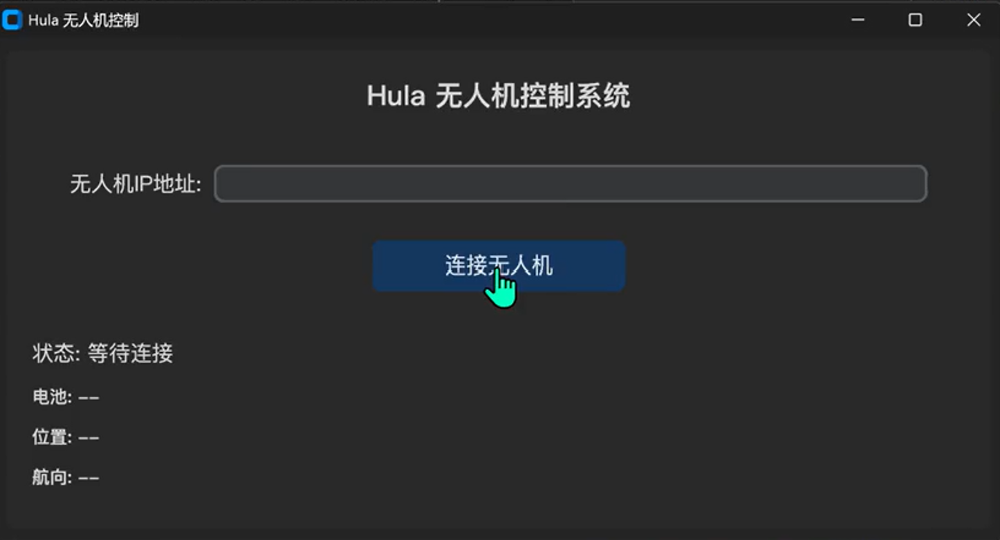
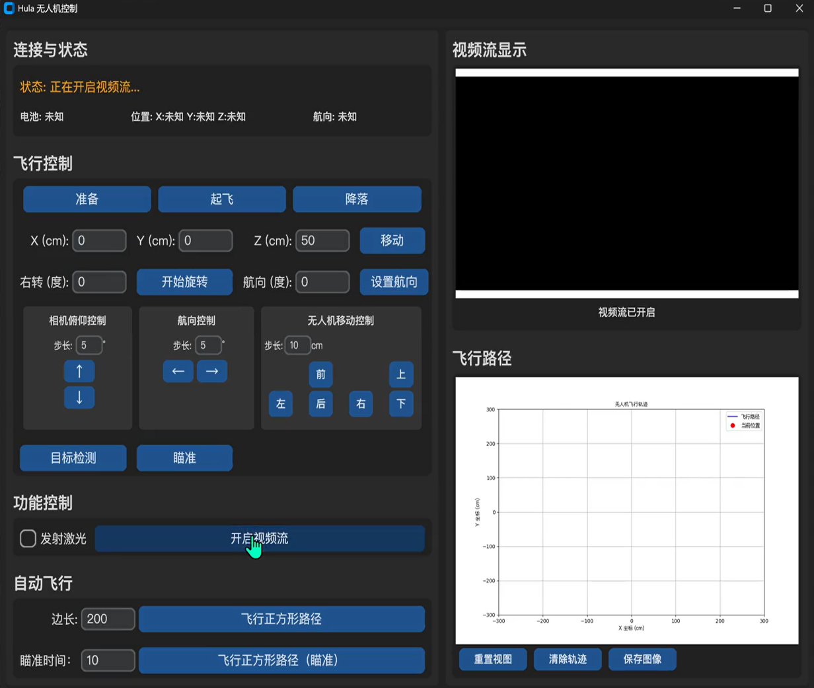

# Hula Drone Control Desktop App

[](https://github.com/XAMPPRocky/tokei_rs)


The Hula Drone Control Desktop App is a comprehensive software suite for the command, control, and analysis of an autonomous drone. Developed as the final coursework for the 'Principle of Automatic Control' course at Sichuan University's College of Electrical Engineering, this app integrates advanced control strategies, computer vision, and a responsive graphical user interface (GUI) to achieve high-precision flight and target interaction.

The core philosophy is to provide a robust platform for both manual operation and complex, automated missions through a modular, safe, and user-friendly design.

---

## Key Features

* **High-Precision Position Control**: Implements a multi-threaded PID control loop for centimeter-level hovering and accurate waypoint navigation.
* **Intelligent Vision System**: Utilizes AprilTag markers for real-time target detection, pose estimation, and automated aiming functionalities.
* **Real-time Situational Awareness**: Features a responsive GUI with live video streaming and 2D flight path plotting, offering the operator a complete view of the drone's status and environment.
* **Asynchronous & Non-Blocking Architecture**: Employs a multi-threaded, event-driven design to ensure the GUI remains fluid and responsive at all times, even during computationally intensive tasks.
* **Automated Flight Planner**: Capable of executing complex, multi-step flight plans with custom actions (e.g., rotation, aiming) at each waypoint.
* **Robust Safety Protocols**: Includes a "progressive disclosure" UI, thorough pre-flight checks, and a graceful exit procedure that ensures the drone lands safely and all data is saved before shutdown.
* **Flight Data Logging & Analysis**: Automatically records detailed telemetry during flight into JSON files and provides a plotting utility to visualize and analyze performance.

---

## System Architecture

The project is built on a clean, three-tier architecture that separates the user interface, core application logic, and low-level backend processes. This design enhances modularity, maintainability, and scalability.



* **Frontend (GUI)**: The user's primary point of interaction, built with the modern **CustomTkinter** library. It is responsible for displaying data and capturing user commands.
* **API (`HulaDrone.py`)**: The central nervous system of the application. It acts as a bridge between the frontend and backend, translating user actions into concrete drone commands and managing the drone's state.
* **Backend**: Comprises the core modules that perform the heavy lifting.
    * `Controller.py`: Manages the high-frequency PID position control loop.
    * `TargetDetectorAruco.py`: Handles all computer vision tasks.
    * `pyhula`: The low-level SDK for direct communication with the drone hardware.



### Typical Workflow

A typical operational sequence follows the workflow illustrated in the diagram below.



1.  **Connect**: Launch the application and connect to the drone.
2.  **Prepare**: Start the drone's background services.
3.  **Takeoff**: The drone will take off and hover.
4.  **Control**: Use manual controls or execute an automated mission.
5.  **Land**: Bring the drone down safely.
6.  **Exit**: The `graceful_exit` procedure will land the drone, save data, and terminate threads.

---

## Core Technologies & Concepts

### Asynchronous & Event-Driven Design

To prevent the GUI from freezing, all long-running tasks are executed in separate background threads. The system uses an event-driven callback mechanism to communicate between these threads and the main GUI thread.



### Computer Vision System

1.  **Camera Calibration**: The drone's camera is calibrated using MATLAB's Camera Calibrator app to correct for lens distortion.

    

2.  **AprilTag Detection & Pose Estimation**: The system uses AprilTags for robust target detection. It solves the Perspective-n-Point (PnP) problem to calculate the marker's 6DoF pose.

    

---

## Graphical User Interface (GUI)

#### Connection Screen

Upon launch, the user is presented with a simple connection screen.



#### Main Control Interface

After connection, the full interface is revealed, providing comprehensive control.



---

## Installation & Setup

Follow these steps to set up and run the project.

**Prerequisites**:

* Python 3.6+
* A virtual environment (recommended)

**Clone the Repository**:

```bash
git clone https://github.com/NostalgiaJohn/HulaDroneControlDestopApp.git
cd https://github.com/NostalgiaJohn/HulaDroneControlDestopApp.git
````


**Install Dependencies**:
The project uses specific versions of libraries listed in `requirements.txt`. The `pyhula` SDK is provided as a wheel file for a specific Python version (cp36) and architecture (win\_amd64).

```bash
# Install the pyhula wheel first from the 'whl' directory
pip install .\whl\pyhula-1.1.5-cp36-cp36m-win_amd64.whl
# Install the rest of the requirements
pip install -r requirements.txt
```

> **Note**: If you are using a different Python version or OS, you may need a different `pyhula` wheel file and might have to adjust dependencies in `requirements.txt`.

**Required Files**:

  * Ensure the camera calibration file `camera_calibration.npz` is in the root directory.
  * Ensure the `fonts` folder containing the PingFangSC fonts is present for proper UI rendering.

-----

## Usage

### Running the Application

To start the control app, run the frontend script:

```bash
python main-frontend.py
```

### Analyzing Flight Data

After a flight, the `Controller.py` module saves a detailed log in the `flight_journals/` directory. You can visualize this data using `plot.py`.

```bash
# This will find the latest flight journal and generate plots
python plot.py
```

-----

## Acknowledgements

This project was completed as the final coursework for the 'Principle of Automatic Control' at the College of Electrical Engineering, Sichuan University.